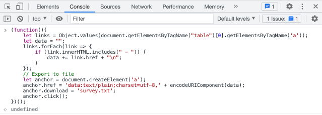

# Script tự động khảo sát cho sinh viên UIT

Điền khảo sát môn học cuối học kỳ tại UIT chỉ với ba bước đơn giản! 🎉

**Bước 1:** Truy cập vào https://daa.uit.edu.vn/sinhvien/phieukhaosat để lấy link phiếu khảo sát môn học.


**Bước 2:** Paste đường link vào tệp tin `survey.txt`, mỗi link trên một dòng.


hoặc **tạo file survey.txt tự động** bằng cách mở Developer Tools Console của trình duyệt (nhấn `Command + Option + J` (Mac) hoặc `Control + Shift + J` (Windows, Linux, Chrome OS)), paste đoạn code dưới đây vào và chọn nơi lưu file cùng thư mục với file `script.sh`

```javascript
(function(){
    let links = Object.values(document.getElementsByTagName("table")[0].getElementsByTagName('a'));
    let data = "";
    links.forEach(link => {
        if (link.innerHTML.includes(" - ")) {
            data += link.href + "\n";
        }
    });
    // Export to file
    let anchor = document.createElement('a');
    anchor.href = 'data:text/plain;charset=utf-8,' + encodeURIComponent(data);
    anchor.download = 'survey.txt';
    anchor.click();
})();
```



**Bước 3:** Mở terminal và thực thi lệnh `sh script.sh`.

**Bước 4 (không bắt buộc):** Đi pha 1 cốc cà phê và quay lại tận hưởng thành quả.


Đừng quên để lại 1 star nếu bạn thấy script hữu ích ;).