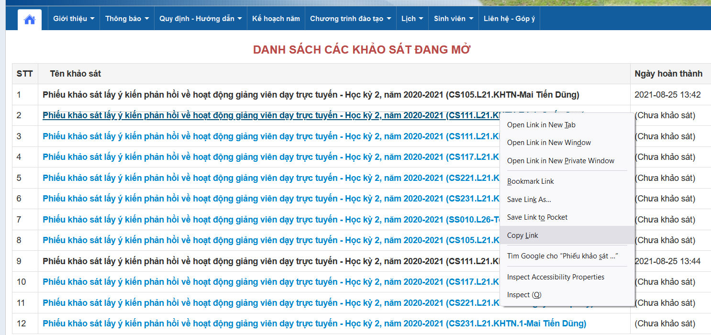
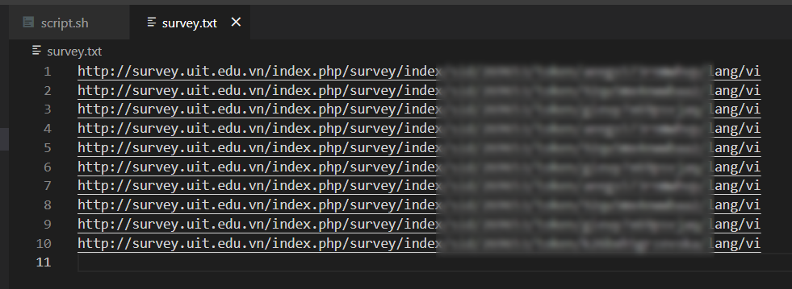
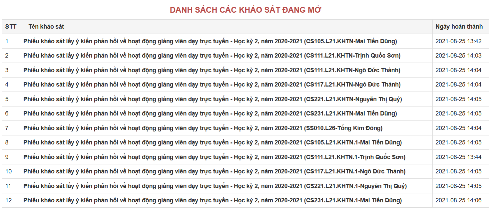

# Script tự động khảo sát cho sinh viên UIT

Điền khảo sát môn học cuối học kỳ tại UIT chỉ với ba bước đơn giản! 🎉

**Bước 1:** Truy cập vào https://daa.uit.edu.vn/sinhvien/phieukhaosat để lấy link phiếu khảo sát môn học.

**Bước 2:** Paste đường link vào tệp tin `survey.txt`, mỗi link trên một dòng.

**Bước 3:** Mở terminal và thực thi lệnh `sh script.sh`.

**Bước 4 (không bắt buộc):** Đi pha 1 cốc cà phê và quay lại tận hưởng thành quả.

Đừng quên để lại 1 star nếu bạn thấy script hữu ích ;).